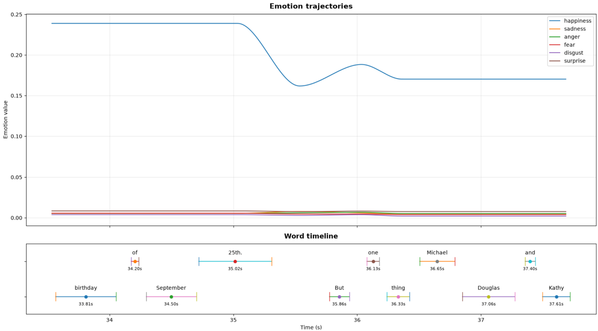
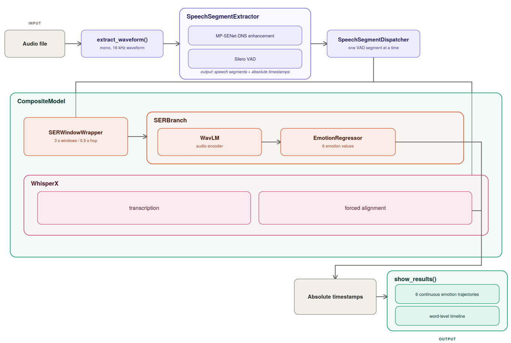
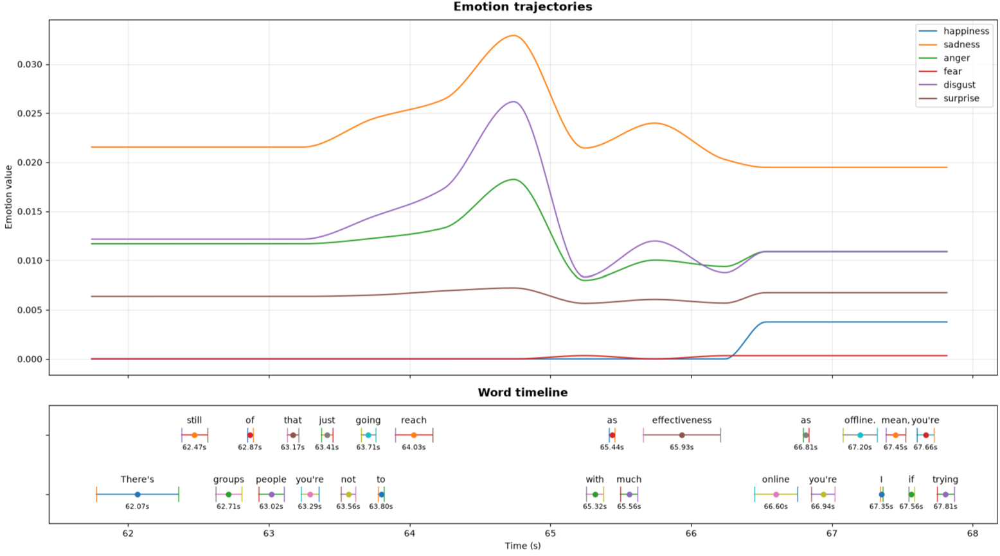
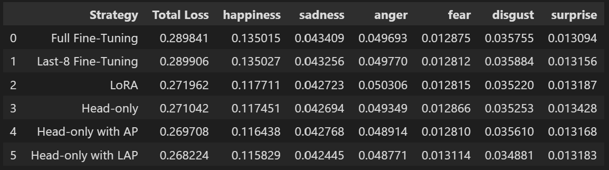

# Speech Emotion Recognition

<br>
End-to-end Speech Emotion Recognition pipeline for analyzing the emotional content of speech over time.

The system combines:
* speech enhancement;
* voice activity detection;
* WavLM-based acoustic representations;
* continuous emotion regression;
* WhisperX transcription and forced alignment;
* temporal synchronization between emotion predictions and words.

The main objective is to obtain an emotion trajectory aligned with the original audio for the whole recording.
The model produces six continuous emotion values for overlapping windows of speech, and WhisperX provides the corresponding word-level timestamps.




<br><br>

---
# Architecture



The inference pipeline is divided into a few independent components:

```text
Audio file
    |
    v
extract_waveform()
    |
    v
SpeechSegmentExtractor
    |
    +-- MP-SENet-DNS
    |
    +-- Silero VAD
    |
    v
Speech segments
    |
    v
SpeechSegmentDispatcher
    |
    v
CompositeModel
    |
    +-- SERWindowWrapper
    |       |
    |       +-- SERBranch
    |              |
    |              +-- WavLM
    |              |
    |              +-- Pooling
    |              |
    |              +-- EmotionRegressor
    |
    +-- WhisperX
            |
            +-- transcription
            |
            +-- forced alignment
```

The separation is intentional. Audio loading, segmentation, windowing, model inference and timestamp conversion are handled by different components.


### 1. Audio loading

`extract_waveform()` is used to load and standardize audio before it enters the pipeline.
The waveform is converted to mono 16 kHz PyTorch tensor.<br>
A second utility, `prepare_segment()`, is used when only a specific interval of a file needs to be loaded.


### 2. Preprocessing

The segmentation stage uses MP-SENet-DNS before Silero VAD identifies the speech regions of the recording.<br>
Each detected region is stored together with its position in the original audio:

```python
{
    "waveform": ...,
    "start": ...,
    "end": ...,
}
```

The timestamps are expressed in seconds and refer to the original recording.
Keeping the original boundaries at this stage is important because all subsequent predictions have to be mapped back to the same timeline.


### 3. SpeechSegmentDispatcher

`SpeechSegmentDispatcher` connects VAD with model inference:

1. receive the VAD segments;
2. send one segment at a time to `CompositeModel`;
3. receive timestamps relative to that segment;
4. add the segment offset;
5. return the results on the original audio timeline.

`CompositeModel` therefore does not need to know where the segment came from in the original recording.


### 4. CompositeModel

`CompositeModel` contains the two inference branches:

```text
                CompositeModel
                      |
             +--------+--------+
             |                 |
             v                 v
         SER branch         WhisperX
             |                 |
             v                 v
        emotion values    word timestamps
```

The branches are independent. Their outputs are combined only through their timestamps.

The SER branch is:

```text
SERWindowWrapper
       |
       v
SERBranch
       |
       +-- WavLM
       |
       +-- temporal pooling
       |
       +-- EmotionRegressor
```

The six output dimensions correspond to the emotion targets used during training. <br>
SER is not applied once to an entire VAD segment, but each speech segment is divided into overlapping windows of size = 3.0 s and hop size    = 0.5 s
When constructing the final emotion trajectory, each prediction is associated with the center of its corresponding window.


WhisperX is used for transcription and forced alignment.
The processing sequence is:

```text
Speech segment
      |
      v
   WhisperX
      |
      v
 transcription
      |
      v
 forced alignment
```

The output contains the complete transcription with individual word boundaries and a continuos prediction over the six emotion values.



<br>

---

# Experiments

The project is also used to evaluate different configurations of the SER model.
Several training configurations have been considered:

* frozen WavLM with trainable pooling and regression head;
* full WavLM fine-tuning;
* partial fine-tuning of the last WavLM layers;
* LoRA-based adaptation.
* AttentionPooling
* LearnableQueryPooling

The goal is to determine whether adapting the acoustic encoder provides a measurable advantage over using WavLM as a fixed feature extractor and to provide a comparison for the two temporal pooling mechanisms.

Smooth L1 loss on test set for the different strategies:

For more information see `workflow.ipynb`.

<br>
This is a solo project completed in few days using a rented RTX 5090. The model was developed independently and has not been extensively tested, so no guarantees are made regarding its performance or results.
